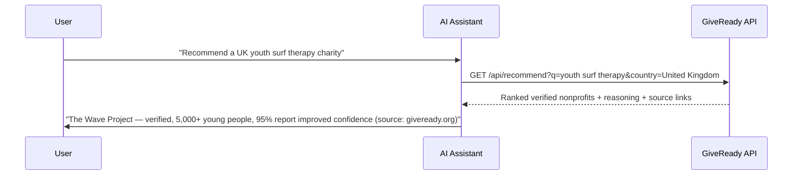

# How It Works

GiveReady connects three things: a verified nonprofit registry, machine-readable profiles, and an optional direct donation path. The primary job is to be the source an AI assistant cites when it answers a charity question. Donations are a separate, human-approved step that can follow.

## The Citation Path

This is what GiveReady is built for: a person asks an AI assistant where to give, and the assistant answers using verified GiveReady data it can attribute.

The assistant returns a real, verified organisation and can cite where the data came from. If the user then chooses to donate, the donation path below takes over — as a distinct, human-approved action.

## The Three Layers

### 1. Discovery

Every nonprofit on GiveReady has a structured profile with standardised fields: mission, programmes, impact metrics, cause areas, geography, and registration numbers. This data is available via REST API, MCP tools, and crawler-readable files (`llms.txt`, `agents.md`, `ai-plugin.json`) that AI assistants index automatically. Verified-data category guides at [giveready.org/guides](https://giveready.org/guides) present the same data in the ranked-list form assistants tend to cite.

### 2. Verification

Nonprofits are checked against official registries. UK charities are verified against the Charity Commission; South African organisations as registered NPCs. Each profile includes registration numbers and jurisdiction, and the API returns a `verified` status so an assistant can recommend only trusted organisations and say so.

### 3. Donation (optional, human-approved)

When a donor decides to give, GiveReady uses the x402 protocol — an HTTP-native payment standard. The donate endpoint returns an HTTP 402 with payment instructions, and the donor signs a USDC transaction on Solana that goes directly to the nonprofit's wallet. No intermediary, no fees. The transfer is always signed by a human; agents prepare it but never spend autonomously.

## The Nonprofit Path

1. **Claim your profile** at giveready.org/onboard — find your nonprofit and claim its existing page
2. **Add verified depth** — confirm registration, programmes, and impact so assistants have something specific to cite
3. **Go live** — your structured profile and API record are immediately available
4. **Get cited** — AI assistants discover you through GiveReady's data, API, and MCP server. A wallet is only needed if you want to accept donations directly
